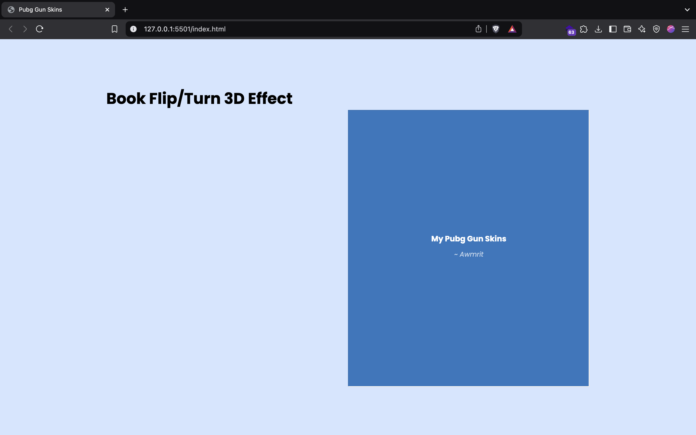
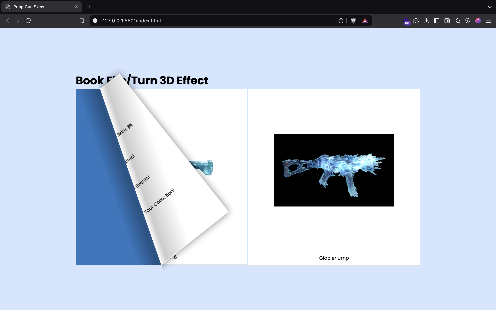
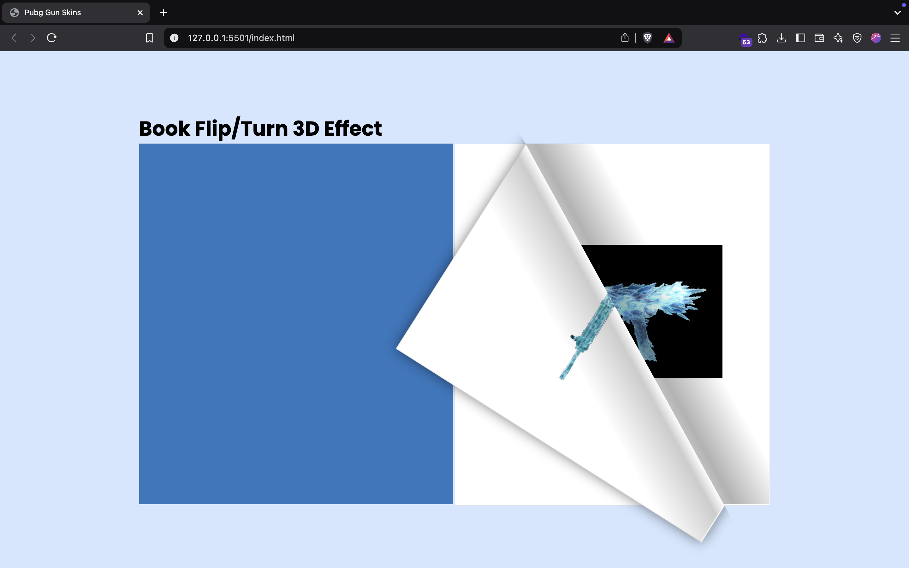

# PUBG Gun Skins Flipbook

This project showcases a flipbook of PUBG gun skins, designed to be responsive for various screen sizes. The flipbook allows users to view different gun skins in a visually appealing format.

## Table of Contents

- [PUBG Gun Skins Flipbook](#pubg-gun-skins-flipbook)
  - [Table of Contents](#table-of-contents)
  - [Features](#features)
  - [Technologies Used](#technologies-used)
  - [Installation](#installation)
  - [Usage](#usage)
  - [Note](#note)

## Features

- **Responsive Design**: The flipbook adjusts its layout based on the screen size, ensuring a great user experience on both desktop and mobile devices.
- **Modern UI**: Clean and visually appealing design using the Poppins font.
- **Interactive Elements**: Users can navigate through different gun skins.

## Technologies Used

- **HTML5**: For the structure of the flipbook.
- **CSS3**: For styling and responsive design.
- **JavaScript**: For interactive elements (using jQuery).
- **Flipbook Plugin**: Utilizes the jQuery Turn.js plugin for the flipbook effect.

## Installation

1. Clone the repository:
   ```bash
   git clone https://github.com/iamawmrit/book-flip-3DEffect.git
   ```

2. Navigate into the project directory:
   ```bash
   cd book-flip-3DEffect
   ```

3. Open `index.html` in your web browser to view the flipbook.

## Usage

- The flipbook displays various PUBG gun skins with images and descriptions.
- Users can interact with the flipbook by flipping through the pages.

## This is what it looks like




## Note

This project is free to use!
